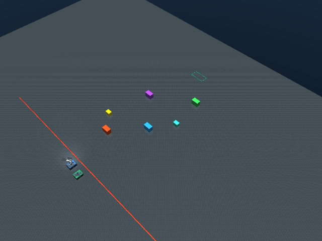
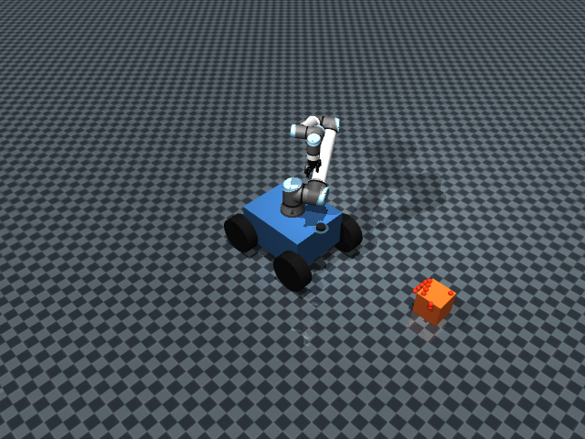
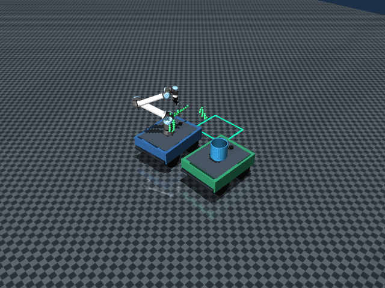
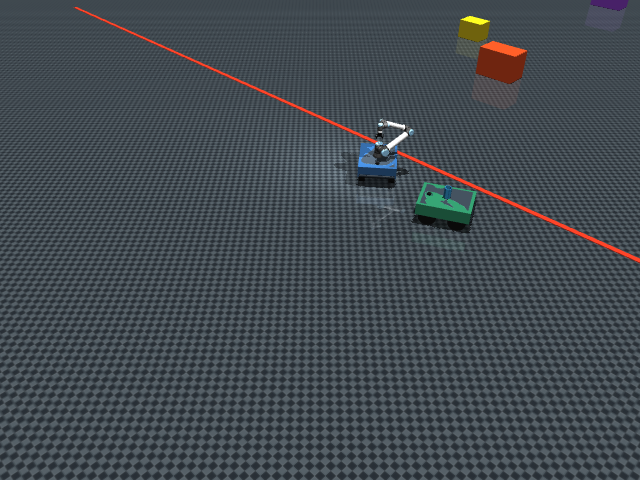

<div align="center">


</div>

# 双车协同核应急移动操作臂仿真

[GitHub 仓库](https://github.com/binbinyoulile/Nuclear-Emergency-Mobile-Manipulator)

基于 MuJoCo 的双车协同核废料回收项目：UR10e 移动操作臂负责雷达避障、D435i 深度相机识别、抓取与投放；运输车负责动态停靠和屏蔽桶转运。项目以纯 Python 状态机实现，并保留清晰的 ROS2 / 真机迁移接口。

## 效果展示

| 长距离场景总览 | 一号车雷达避障 |
| --- | --- |
|  |  |

| 双车协同抓取 | 两车精准返航 |
| --- | --- |
|  |  |

## 核心能力

- **双车协同**：共享 `CarController` 底盘控制，实现差速运动、平滑加减速、雷达局部避障和动态停靠。
- **D435i 视觉**：离屏渲染 RGB/深度图，通过 HSV 分割、5x5 深度中位数和相机内外参变换得到世界坐标。
- **机器人操作**：UR10e + Robotiq 2F-85，使用 mink IK 完成平躺圆柱中段侧向抓取与桶内投放。
- **任务闭环**：起点出发、长距离避障、并行调度、抓取投放、倒车脱离辐射区、正向精准返航。
- **迁移友好**：视觉的数据获取与坐标变换层、底盘和机械臂控制层均有明确接口，便于替换为 ROS2 话题和 TF2。

## 底盘模型

两辆车按企业真实重载底盘参数建模（`models/universal_robots_ur10e/dual_mobile_ur10e.xml`）：

| 参数 | 数值 |
|---|---:|
| 整车质量（底盘 + 四轮） | `75 kg`（车体 `65 kg` + 四轮 `10 kg`） |
| 外形尺寸 长×宽×高 | `0.912 × 0.710 × 0.410 m` |
| 离地间隙 | `0.11 m` |
| 轴距 | `0.50 m`（前轮 X=`+0.25`，后轮 X=`-0.25`） |
| 轮距 | `0.555 m`（左轮 Y=`+0.2775`，右轮 Y=`-0.2775`） |
| 轮径 | `0.305 m`（轮心 Z=`0.1525`） |
| 顶面（机械臂/雷达安装板） | `z = 0.40356` |

- 物理碰撞体是一个按真实包络定位的 Box（车体 `65 kg`），四轮按真实轴距/轮距布置，各 `2.5 kg`。
- 纯外观件（车身外壳、前后防撞管、顶部安装板、雷达托盘）全部 `contype="0" conaffinity="0"`、`mass="0"`，不参与物理。
- 已知偏差：参数表标注"四轮差速转向"，但控制器运动学使用前轮转向角；去掉转向节后实测原地转仅 `0.13 rad/s` 且车体滑移 `0.3 m`，任务定位精度不足，因此暂保留前轮转向节作为等效机构，待控制器改为纯差速转向后再移除。
- 机械臂模型（Menagerie UR10e）自身约 `33.8 kg`，因此一号车整机仿真质量约 `108.8 kg`（真实 75 kg 底盘 + UR10e + 夹爪）。

## 环境要求

- Python 3.10+
- Windows、Linux 或 macOS
- 支持 OpenGL 的运行环境（实时预览需要）
- 当前基准环境：Python 3.13.12、`mujoco 3.16.0`、`mink 1.3.0`、`opencv-python 5.0.0.93`、`numpy 2.5.4`、`scipy 1.18.1`

## 快速开始

### Windows PowerShell

```powershell
powershell -ExecutionPolicy Bypass -File .\setup.ps1
.\.venv\Scripts\python.exe scripts\fetch_models.py
.\.venv\Scripts\python.exe .\dual_car_pick_place.py --seed 7
```

### Linux / macOS

```bash
bash setup.sh
source .venv/bin/activate
python scripts/fetch_models.py
python dual_car_pick_place.py --seed 7
```

无窗口验收并更新核心截图：

```powershell
.\.venv\Scripts\python.exe .\dual_car_pick_place.py --snapshot --seed 7
```

`setup.sh` / `setup.ps1` 只创建项目内 `.venv`，不会使用 `--system-site-packages`。脚本运行结束后会提示模型资产下载命令。

## 模型资产

MuJoCo 网格文件体积较大，因此 `models/**/assets/`、`*.obj` 和 `*.stl` 已加入 `.gitignore`。仓库保留必要的 MJCF、许可证和说明文件；新环境执行：

```powershell
python scripts\fetch_models.py
```

脚本从 [MuJoCo Menagerie](https://github.com/google-deepmind/mujoco_menagerie) 获取：

- [Universal Robots UR10e](https://github.com/google-deepmind/mujoco_menagerie/tree/main/universal_robots_ur10e)
- [Robotiq 2F-85](https://github.com/google-deepmind/mujoco_menagerie/tree/main/robotiq_2f85)

自建的 `dual_mobile_ur10e.xml` 将 UR10e、2F-85、移动底盘和 D435i 安装关系组合在同一 MuJoCo 层级中。

## 工程结构

```text
mobile_manipulator/
├── dual_car_pick_place.py   # 双车任务状态机、雷达避障、视觉与协同投放
├── mobile_pick_place.py     # 共享底盘、IK、夹爪与仿真运动底层
├── dual_car_scene.xml       # 双车主场景
├── arm_ik_scene.xml         # 机械臂 IK 辅助场景
├── models/                  # 自建 MJCF；二进制 mesh 由脚本下载
├── scripts/fetch_models.py  # Menagerie 资产下载脚本
├── scripts/run_matrix.py    # 多 seed 回归矩阵（CSV + 每 seed 日志）
├── docs/screenshots/        # 4 张核心展示截图
├── requirements.txt
├── setup.ps1
└── setup.sh
```

## 任务流程

1. 两车从红线后方的固定起点出发。
2. 一号车通过雷达局部避障前往目标区，二号车在收到一号车停稳坐标后并行出发。
3. 一号车用 D435i RGB/深度图识别黄色放射源，并打印像素、深度、视觉坐标和真值误差。
4. UR10e 从中段侧面抓取圆柱，二号车动态停靠到绿框外：全程纯追踪平滑转弯入位，
   到点**完全不原地转**——差速原地转在地面上是轮胎打滑，只为补正几度就会把车整体
   滑移 2 cm，而且正好发生在机械臂准备投放、车身必须绝对静止的时刻。
   停靠点 Y 预留 0.06 m 车身投影余量，任何朝向下都越不过绿框边界。
   一号车抓取前同理：只有残余偏航超过 12° 才原地摆正，实测 21 个种子残差都在
   0.1°~9.2°，全部直接留着不动车。
5. 一号车将圆柱投入二号车屏蔽桶，随后两车倒车脱离辐射区并正向精准返航。
6. 终态检查：物体在桶内、两车回到起点、车车物理接触数为 0。

目标区按 UR10e 工作空间收紧为 `0.70 × 0.60 m`（X `±0.35`，Y `20.70 ~ 21.30`），
放射源在该框内随机；`dual_car_pick_place.py` 的 `TARGET_ZONE_*` 常量与
`dual_car_scene.xml` 的四个绿色边框 geom 一一对应，改一处必须同步另一处。

## 视觉四层架构

1. `get_camera_data()`：MuJoCo `Renderer` 采集 RGB/depth；ROS2 中替换为 D435i 图像话题订阅。
2. `detect_yellow_target()`：HSV 阈值、形态学去噪、最大轮廓质心。
3. `pixel_to_world()`：深度中位数、针孔相机反投影和 `cam_xpos/cam_xmat` 外参变换；ROS2 中使用 `tf2_ros`。
4. 任务状态机：仅使用视觉返回坐标执行抓取，真实物体坐标只用于误差验证。

## 多 seed 回归与验证基线

单次成功不能说明可靠性，因此每次改动后跑同一组种子：

```powershell
D:\Python313\python.exe .\scripts\run_matrix.py --seeds 0-20
```

脚本逐个起 `--headless` 子进程（不覆写截图），单种子超时保护，把指标写入
`reports/regression.csv`、每个种子的完整日志写入 `reports/logs/seed_<n>.log`。
任务本身在成功/失败时都会打印一行 `RESULT_JSON:` 并以退出码 `0`/`1` 结束，
失败时 `stage` 字段直接指出卡在哪个阶段。

`seed 0–20`（21 个）当前基线：

- 通过率：`21/21`
- D435i 视觉坐标误差：`8.5 ~ 10.0 mm`
- 桶内 XY 误差：`0.001 ~ 0.005 m`（容差 `0.05 m`）
- 停靠时刻两车中心距：`0.967 ~ 1.114 m`（安全阈值 `0.82 m`），全程最小中心距 `0.964 ~ 1.066 m`，物理接触 `0`
- 二号车停靠后车身上沿：`20.474 ~ 20.672 m`（绿框下边界 `20.700 m`）
- 一号车抓取前残余偏航：`0.1° ~ 9.2°`（超过 `12°` 才原地摆正，全部种子都不需要）
- 回起点误差：CAR1 `0.084 ~ 0.086 m`，CAR2 `0.090 ~ 0.096 m`（阈值 `0.20 m`）
- 单次仿真时长：`54.0 ~ 63.1 s`

## 版本与里程碑

### v1.0.0 — 仿真基线闭环（2026-11-07，tag `v1.0.0`）

第一版"物理可信、逻辑闭环、可回归"的仿真基线，作为后续 Isaac Sim / 真机迁移的对照基准。

已闭环的内容：

- **底盘物理保真**：按企业参数表重构 75 kg 真实重载车（车体 65 kg + 四轮 10 kg、
  912×710×410 mm、轮径 305 mm、轴距 500 mm、轮距 555 mm、四轮独立驱动、前后防撞管），
  视觉件 `mass=0` 且不参与碰撞。
- **两车协同全流程**：雷达避障 → 视觉识别（误差 8.5~10.0 mm）→ 侧面抓取 →
  动态停靠（不原地转、车身投影留在绿框外）→ 协同投放（桶内误差 1~5 mm）→
  倒车脱离 → 正向精准返航（回起点 0.08~0.10 m）。
- **物理真实性**：全程无穿模、无翻车、无"锁死物理/瞬移"作弊；车车物理接触 0；
  抓取与投放期间两车底盘逐帧静止（只有机械臂反作用造成的毫米级微动）。
- **可回归**：`seed 0–20` 21/21 通过，指标落 `reports/regression.csv`，
  单次仿真 54~63 s，本机约 20 分钟跑完一轮。

复现这一版：

```powershell
git checkout v1.0.0
D:\Python313\python.exe .\scripts\run_matrix.py --seeds 0-20
```

### 已知限制（迁移前需要解决）

- 前轮转向节是"等效机构"：控制器运动学用转向角 + 轮速差，与厂家"四轮差速转向"
  不完全一致；改纯差速需重写横摆控制并重新标定（见 `底盘模型` 一节）。
- 雷达检测距离 2.8 m 小于 3.5 m 制动距离，限速与避障阈值还没有做联合标定。
- 摩擦、静摩擦门限、接触参数仍是仿真整定值，未经真实轮胎辨识。
- 视觉是渲染图像 + HSV 阈值，真机需要标定与去噪流程替换。

## 跨平台路径

脚本统一以 `Path(__file__).resolve().parent` 定位项目文件。MuJoCo 加载前会临时切换到场景目录并使用相对文件名，规避 Windows 中文绝对路径兼容问题，同时保持 Linux 路径可用。

## License

UR10e 模型文件遵循 MuJoCo Menagerie 中附带的 BSD-3-Clause License；Robotiq 2F-85 资产按其上游许可证使用。项目自建代码与场景用于学习、科研和作品展示。
